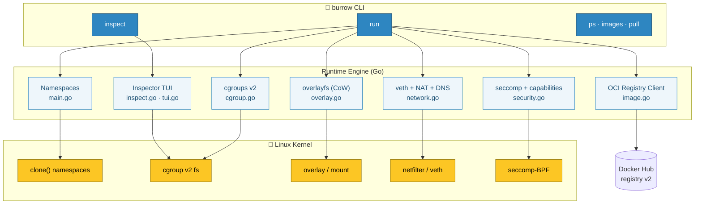
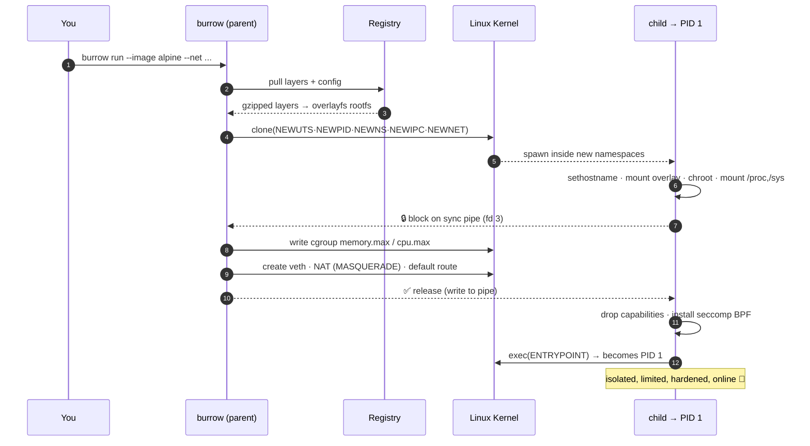
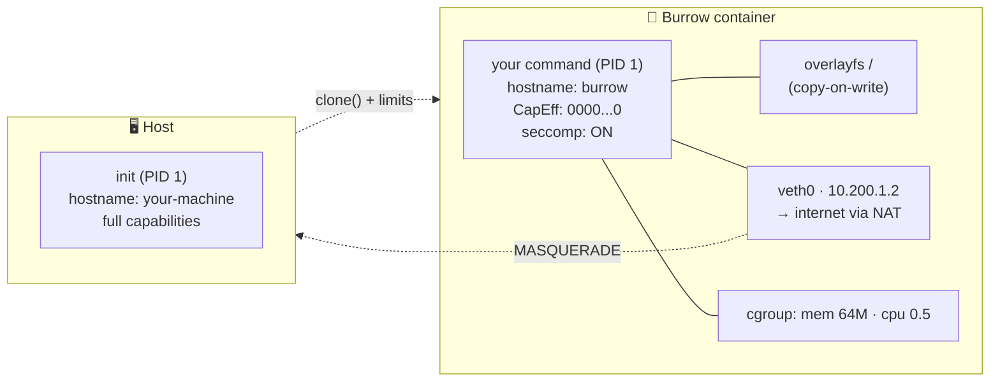

<div align="center">

# 🐇 Burrow

### A container runtime in Go — built from scratch, to see how containers *really* work.

*Pull a real image. Isolate it. Limit it. Network it. Harden it. Watch it run.*
*A `runc` / `crun` / `podman` in miniature — in ~1,300 lines of readable Go.*

<br/>


[](https://github.com/rajmodi262/burrow/actions/workflows/ci.yml)


</div>

---

> **What is this?** A container isn't magic — it's an ordinary Linux process wearing a costume made of
> **namespaces**, **cgroups**, **overlay filesystems** and **seccomp** filters. Burrow builds that costume,
> piece by piece, in plain Go — so you can read every line and understand exactly what platforms like
> **Docker**, **Podman** and **OpenShift** do under the hood.

```console
$ sudo burrow run --image alpine --net --seccomp --drop-caps --mem 64m /bin/sh
burrow: pulling library/alpine:latest ...
  layer 1/1 cc21d7e2f7b1
/ # hostname
burrow
/ # cat /etc/os-release | head -1
NAME="Alpine Linux"
/ # ping -c1 1.1.1.1
64 bytes from 1.1.1.1: seq=0 ttl=56 time=27.9 ms      # ← real internet, via NAT
```

---

## ✨ Features

| | Capability | How |
|:---:|:---|:---|
| 📦 | **Pulls real OCI images** | A from-scratch Docker registry v2 client — token auth, multi-arch manifests, gzip layer extraction with whiteouts. *No Docker required.* |
| 🧩 | **Namespace isolation** | UTS, PID (your process is **PID 1**), mount, IPC, and optional **network** + **user** namespaces |
| 🎛️ | **cgroups v2 limits** | `--mem 64m` and `--cpu 0.5`, enforced by the kernel |
| 🗂️ | **Copy-on-write root** | An **overlayfs** upper layer — container writes never touch the base image |
| 🌐 | **Real networking** | `--net` → veth pair + **NAT + DNS**: the container reaches the **internet** |
| 🚀 | **Image entrypoints** | Honours the image's `ENTRYPOINT` / `CMD` / `ENV` / `WORKDIR` — `burrow run --image hello-world` just works |
| 🛡️ | **Seccomp** | A **hand-written classic-BPF** filter that `EPERM`s dangerous syscalls |
| 🔒 | **Capability dropping** | Empties every capability set via raw `capset` / `prctl` |
| 👤 | **Rootless** | `--userns` maps container `uid 0` → your unprivileged host user (no `sudo`) |
| 🔭 | **Live inspector** | `burrow inspect` — a real-time **Bubble Tea TUI** of namespaces, cgroup usage & mounts |
| 🧰 | **Real CLI** | `burrow ps`, `burrow images`, `burrow pull`, plus signal-safe cleanup |

---

## 🏗️ Architecture



---

## 🔄 What happens on `burrow run`

The parent process pulls the image, then `clone()`s a child into fresh namespaces. The child sets itself up
and **blocks on a sync pipe** until the parent finishes cgroup + network wiring — then it drops privileges
and *becomes* the container's PID 1. (This start-barrier is exactly how `runc`/`crun` avoid start races.)



---

## 🧬 The isolation, visualized



<div align="center"><i>Same kernel. Different world.</i></div>

---

## 🚀 Quickstart

```bash
# build
make build            # → ./burrow   (Linux + cgroup v2; WSL2 works great)

# run a real Alpine shell
sudo ./burrow run --image alpine /bin/sh

# a container with kernel-enforced limits
sudo ./burrow run --image alpine --mem 32m --cpu 0.5 /bin/sh

# a container with its own network + internet
sudo ./burrow run --image alpine --net /bin/sh

# a hardened container: seccomp filter + zero capabilities
sudo ./burrow run --image alpine --seccomp --drop-caps /bin/sh

# rootless — no sudo needed
./burrow run --userns /bin/sh

# tooling
sudo ./burrow ps          # running containers
./burrow images           # pulled images
sudo ./burrow inspect     # live TUI of a running container
```

> **Requirements:** Linux with a cgroup v2 unified hierarchy (default on modern kernels, including **WSL2**
> 6.x). Everything except `--userns` needs `root`. Networking needs `iptables`.

---

## 🎬 Demos you can reproduce

<details open>
<summary><b>📦 Run an image by its entrypoint — like <code>docker run hello-world</code></b></summary>

```console
$ sudo ./burrow run --image hello-world

Hello from Docker!
This message shows that your installation appears to be working correctly.
...
```
</details>

<details>
<summary><b>🌐 Real internet inside the container (NAT + DNS)</b></summary>

```console
$ sudo ./burrow run --image alpine --net /bin/sh -c 'wget -qO- http://example.com | grep -o "<title>.*</title>"'
<title>Example Domain</title>
```
</details>

<details>
<summary><b>🛡️ Seccomp blocks a syscall</b></summary>

```console
$ sudo ./burrow run --image alpine --seccomp /bin/sh -c 'mount -t tmpfs none /mnt'
mount: permission denied            # the mount(2) syscall is EPERM'd by the BPF filter
```
</details>

<details>
<summary><b>🔒 Capability dropping — root that can't do root things</b></summary>

```console
$ sudo ./burrow run --image alpine --drop-caps /bin/sh -c 'grep CapEff /proc/self/status; hostname x'
CapEff: 0000000000000000            # every capability dropped
hostname: sethostname: Operation not permitted
```
</details>

<details>
<summary><b>👤 Rootless — container root maps to your host user</b></summary>

```console
$ ./burrow run --userns /bin/sh -c 'id; cat /proc/self/uid_map'
uid=0(root) gid=0(root)             # root inside...
         0       1000          1    # ...mapped to host uid 1000 outside
```
</details>

<details>
<summary><b>🔭 The live inspector (<code>burrow inspect</code>)</b></summary>

```
╭──────────────────────────────────────────────╮
│  Burrow Inspector                              │
│                                                │
│  container  pid=10389  comm=sleep  host=burrow │
│  namespaces  (isolated = different than host)  │
│    uts     uts:[4026532290]   ISOLATED         │
│    pid     pid:[4026532296]   ISOLATED         │
│    mnt     mnt:[4026532298]   ISOLATED         │
│    net     net:[4026531840]   shared           │
│  cgroup  /burrow.10389                         │
│    memory.current = 1.3 MiB   memory.max = 32M │
│    cpu.max = 50000 100000                      │
│  mounts  42 total                              │
│  refreshing every 0.5s — press q to quit       │
╰──────────────────────────────────────────────╯
```
</details>

---

## 🧭 Command reference

| Command | Description |
|:---|:---|
| `burrow run [flags] <cmd>` | Create and run a container |
| `burrow pull <image>` | Pull an OCI image into the local cache |
| `burrow ps` | List running containers |
| `burrow images` | List pulled images |
| `burrow inspect [--once] [pid]` | Live TUI (or one-shot snapshot) of a container |
| `burrow version` | Print the version |

**`run` flags:** `--image NAME` · `--rootfs DIR` · `--mem 64m` · `--cpu 0.5` · `--net` · `--seccomp` · `--drop-caps` · `--userns`

---

## 📁 Project structure

```
burrow/
├── main.go        # CLI, run/child lifecycle, namespaces, start-sync pipe
├── image.go       # from-scratch OCI registry v2 client + image config
├── cgroup.go      # cgroups v2 memory/CPU limits + parsers
├── overlay.go     # overlayfs copy-on-write rootfs
├── network.go     # veth pair + NAT/MASQUERADE + DNS
├── security.go    # seccomp BPF filter + capability dropping
├── inspect.go     # /proc introspection + snapshot renderer
├── tui.go         # Bubble Tea live inspector
├── cli.go         # ps / images
├── prune.go       # stale-cgroup cleanup
└── *_test.go      # unit tests (parsers, formatters)
```

---

## 🗺️ Roadmap

- [x] Namespaces (UTS · PID · mount · IPC) + `/proc`
- [x] cgroups v2 — memory **and** CPU
- [x] Live `/proc` inspector TUI
- [x] overlayfs copy-on-write rootfs
- [x] Network namespace + veth + **internet (NAT + DNS)**
- [x] **OCI image pull** + image `ENTRYPOINT`/`ENV`
- [x] **seccomp** · **capability dropping** · **user namespaces** (rootless)
- [x] `ps` / `images`, start-sync pipe, signal-safe cleanup
- [ ] User-supplied seccomp / OCI `config.json` profiles
- [ ] Image signature verification · port publishing · cgroup delegation

---

## ⚠️ Not for production (on purpose)

Burrow is a **learning tool**. It intentionally omits the hardening a real runtime needs — user-defined
seccomp profiles, read-only/masked kernel paths, image signature checks, and more. The goal is a small,
honest codebase you can read end-to-end and truly understand. Each omission is a great *"what would it take
to do this properly?"* question.

---

## 🙏 Inspiration

Standing on the shoulders of the tools this was built to understand — **[runc](https://github.com/opencontainers/runc)**,
**[crun](https://github.com/containers/crun)** and **[Podman](https://github.com/containers/podman)**,
and Liz Rice's *"Containers from Scratch"* talks.

---

<div align="center">

**Built by [Raj Modi](https://github.com/rajmodi262)** · Made to understand, not to ship.

<sub>🐇 A container is just a process that believes it's alone.</sub>

</div>
